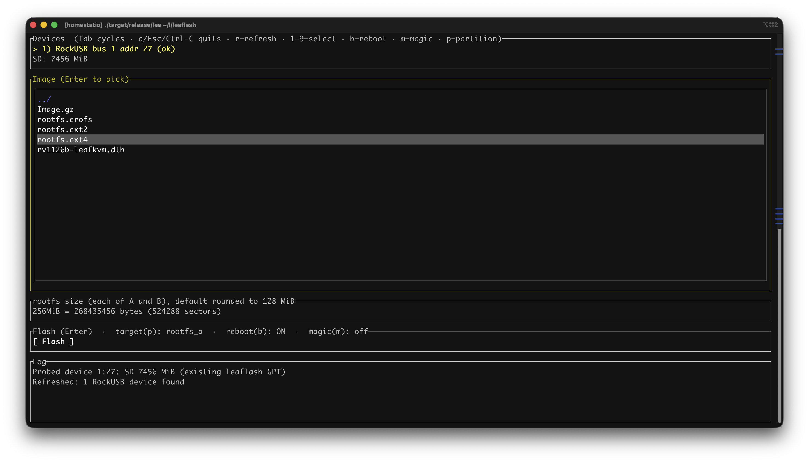

# leaflash

> [!IMPORTANT]
> Though the repository heavily relies on LLM for coding, we ensure that each functionality have been extensively tested on our real devices, including various edge cases and our team members are dogfooding the tool as well. 



Development CLI for the [LeafKVM](https://www.crowdsupply.com/leafkvm/leafkvm) device.

```text
leaflash flash -i image.img             # SD card; in-place A/B-aware refresh
leaflash tui                             # interactive
leaflash usb <subcommand>                # nested rockusb-cli
leaflash switch-rootfs                  # flip the bootable A/B slot
```

Every subcommand also has short aliases: `f`/`sd`, `ub`/`spi`, `t`, `us`, `sw`/`switch`.

## Subcommands

### `flash` (alias `f`, `sd`) — write to the SD card

Manages an A/B layout: `rootfs_a`, `rootfs_b`, `userdata`. The common
case is an in-place refresh that **does not touch the partition table
or userdata**:

```sh
leaflash flash -i image.img       # writes to whichever slot the GPT marks bootable
leaflash flash -i image.img -p rootfs_b   # write to the other slot
leaflash flash -i image.img -p both       # write to both slots
leaflash flash -i image.img -r            # also reset the device after flash
```

Defaults that the on-disk GPT supplies when omitted:

- `-p, --partition` — the slot with the legacy-BIOS-bootable bit.
- `-s, --rootfs-size` — size of one rootfs slot, read from the GPT.

The first time you flash a card (or any time the layout changes) you need
explicit values **and** `--allow-partition`, since rewriting the GPT
destroys userdata:

```sh
leaflash flash -i image.img -s 256MiB -p rootfs_a --allow-partition
```

Other flags:

| Flag | Meaning |
|---|---|
| `-d, --device <bus>:<address>` | pick a specific RockUSB device when several are attached |
| `-r, --reset-after-flash` | reboot the device when the flash finishes |
| `-m, --userdata-magic` | write `LEAFKVMUSERDATAMAGIC` at the start and end of userdata so the bootloader auto-wipes it on next boot (rather than prompting) |
| `-p, --partition <rootfs_a\|rootfs_b\|both>` | target slot(s) |
| `--allow-partition` | required guard for any flash that rewrites the GPT |

### `tui` (alias `t`) — interactive TUI

Multi-device aware (`r` refreshes, `1`-`9` selects when more than one
RockUSB device is attached). After picking an image and rootfs size,
press the Flash button to open a confirmation dialog that lists the
target slot, both partition sizes, the SD capacity, and an estimate of
userdata. The chosen slot renders as `rootfs_X (active)` in green when
it matches the slot the on-disk GPT marks bootable, so you can
immediately tell whether the flash is an in-place refresh or a slot
switch.

Keys (top-level): `Tab` cycles focus, `q`/`Esc`/`Ctrl-C` quits,
`r` refreshes devices, `1`-`9` selects a device, `b` toggles
reboot-after-flash, `m` toggles userdata-magic, `p` toggles target
partition (`A → B → Both → A`).

### `switch-rootfs` (alias `sw`, `switch`) — flip the active slot

Toggles the `LegacyBIOSBootable` attribute between `rootfs_a` and
`rootfs_b` on the SD card's GPT, so the next boot uses the other slot.
With no `--partition`, it switches to whichever slot is currently
inactive; if neither slot is marked active it warns and picks
`rootfs_a`.

```sh
leaflash switch-rootfs                # flip to the inactive slot
leaflash switch-rootfs -p rootfs_b    # explicitly target rootfs_b
leaflash switch-rootfs -d 1:5         # pick a specific RockUSB device
```

### `usb` (alias `rk`) — low-level rockusb

Nested verbatim from
[`rockusb-cli`](https://github.com/wtdcode/rockchiprs/tree/dev/rockusb-cli):
`list`, `download-boot`, `read`/`write` LBAs, `switch-storage`,
`reset-device`, …  Useful for one-off operations (recovery, exploring
flash state) when the higher-level subcommands aren't a fit.

## Build

```sh
cargo build --release
```

The `Release` GitHub workflow cross-compiles on every `v*` tag and
publishes raw binaries for Linux (musl), macOS, and Windows on both
amd64 and aarch64 — `leaflash-linux-amd64`, `leaflash-linux-aarch64`,
`leaflash-macos-amd64`, `leaflash-macos-aarch64`,
`leaflash-win-amd64.exe`, `leaflash-win-aarch64.exe`. One curl, no
extract:

```sh
curl -L -o leaflash https://github.com/Leafkvm/leaflash/releases/latest/download/leaflash-linux-amd64
chmod +x leaflash
```
